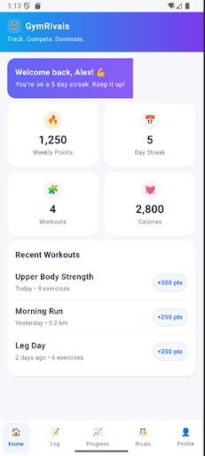
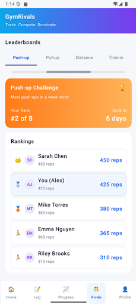
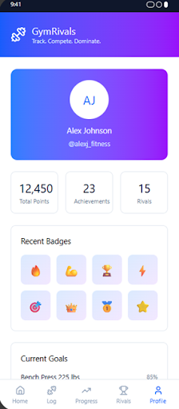

# GymRivals

GymRivals is an Android fitness app built as a **Mobile App Development group project**. It helps users stay consistent with workouts by combining personal tracking (runs, strength, reps) with friendly competition.

## What GymRivals does
- Logs **strength workouts** and tracks session history
- Tracks **outdoor runs** with GPS + map support
- Counts **push-up/squat reps** in real-time using camera-based pose detection
- Supports social motivation through **Rivals**, profile/progress screens, and streak-style engagement

## Key features
- Jetpack Compose multi-tab app (Home, Log, Progress, Rivals, Profile)
- Run tracking with Google Maps + location services
- ML Kit Pose Detection + CameraX rep counter
- Firebase Authentication (Google Sign-In)
- Firestore-backed cloud data for workouts/history

## Tech stack
- **Kotlin**
- **Jetpack Compose**
- **Navigation Compose**
- **Firebase Auth + Firestore**
- **Google Maps / Location Services**
- **ML Kit Pose Detection**
- **CameraX**

## Screenshots

<table>
  <tr>
    <td></td>
    <td></td>
    <td></td>
  </tr>
</table>

## Run locally (Android Studio)
1. Open the project in Android Studio.
2. Use **JDK 17** for best compatibility.
3. Sync Gradle.
4. Run on emulator/device (API 31+).
